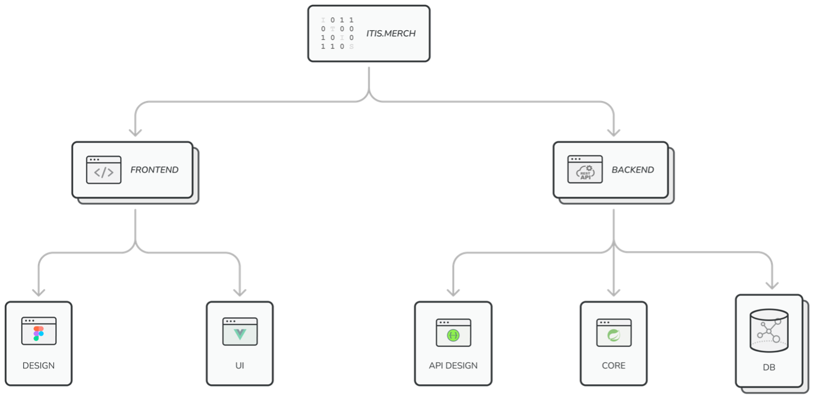

# **ITIS MERCH**

## **Общее описание системы**

### **Цель проекта**
**Цель проекта** – разработать онлайн-магазин для продажи мерча Казанского Федерального Университета. На первом этапе реализации на площадке будет размещен только мерч Института Информационных Технологий и Интеллектуальных систем.

### **Функциональные блоки**
Система состоит из следующих функциональных блоков:
1. Авторизация через kpfu.ru
2. Функционал для авторизованного пользователя
3. Функционал для администратора сайта
4. Функционал для оплаты через СБП

Пройдемся по каждому блоку чуть более подробно.

#### **Авторизация**
Авторизация будет происходить на страничке авторизации, где будет располагаться форма, состоящая из двух полей: логин и пароль. Авторизация будет проходить через KPFU API.

#### **Функционал пользователя**
Пользователь будет иметь следующий функционал:
1. Просмотр каталога товаров и категорий
2. Добавление товаров в корзину
3. Оформление заказа
4. Оплата через СБП

#### **Функционал администратора**
Администратор, в свою очередь, вместе с функционалом пользователя будет иметь и дополнительный функционал: добавление / удаление товаров / категорий.

#### **Оплата**
Оплата на сайте будет происходить через СБП. Возможно, в случае возникновения бюрократических сложностей это будет заменено на Qiwi / Stripe / YooMoney.

## **Термины**
Онлайн-магазин – сайт, который будет служить
площадкой для продажи каких-либо вещей. В нашем случае – мерча.

**Пользователь** – студент КФУ, авторизовавшийся через kpfu.ru.

**Администратор** – тот пользователь, но с дополнительными возможностями в виде добавления новых категорий и товаров.

**Логин** – набор символов, состоящий из почты студента с сайта КФУ без домена. Пример: студент – Иванов Иван Иванович, логин – IIIvanov.

P. S. Для упрощения задачи я решил не вводить дополнительную роль в виде менеджера. Еще одной из причин почему стал тот факт, что в нашей системе и менеджер, и администратор имеют одинаковый функционал. Поэтому разделять их смысла как такового нет, на это лишь уйдет время, которое для нас очень важно.

## **Стек технологий**
Для реализации системы будет применен следующий стек технологий:
### **Front-end**
На клиенте UI будет выполнен на `Vue.js`. В
качестве framework-agnostic инструмента сборки клиента будет использован `Vite`. А для создания асинхронных запросов будем использовать библиотеку `Axios`.

### **Back-end**
Бизнес-логика будет написана на `Java Spring Framework`. Также, разумеется, это будет RESTful приложение. Вместе с этим будет использован `Swagger OpenAPI` для проектирования и документации API.
В качестве базы данных выбор пал на `MySQL` и на `MongoDB`.

## **Технические требования**
Среди технических требований можно выделить следующие:
1. Передача статического содержимого пользователю через CDN
2. Сопровождение разработки постоянным документированием как кода, так и архитектуры в целом
3. Масштабируемость для дальнейшей поддержки и изменений

### **Приблизительные оценки**
Следующие оценки основаны на множестве предположений, поэтому вероятнее всего они будут меняться с течением времени.
1. Примерно 80 DAU в самом начале функционирования проекта
2. Пользователи ежедневно смотрят примерно 2-3 категории
3. Зачастую, пользователи просматривают все товары в категории
4. Пользователи подробно просматривают 50% всех товаров в категории
5. По грубым подсчетам нагрузка будет составлять ~2 RPS

## **Прочие требования**
Хотелось бы отметить следующее:
1. Минималистичный дизайн, акцент на контент,
белый фон
2. Настроение должно быть широким: от
официально деловой до непринужденной
обстановки
3. Одежда должна быть интересным сочетанием
    streetwear и preppy.

## **Схема базы данных**
Перед тем как строить схему базы данных я вновь проговорю необходимые функциональные требования:
1. Авторизация
2. Просмотр каталога
    * По категориям
    * Всего
3. Добавление товара в корзину
4. Оформление заказа
5. Оплата через СБП (пока что ТОЛЬКО через СБП)
6. Админ панель

Посмотреть саму схему базы данных можно по этой ссылке: https://dbdiagram.io/d/64132b91296d97641d888500

### **Сущности**
Всего в БД будут находиться 6 сущностей. Подробнее о каждой из них.
1. user. Представляет из себя авторизованного пользователя, содержит следующие поля:
    * id int [primary key] – айди пользователя в БД КФУ. 
    * role user_role – ENUM, роль пользователя на сайте (CLIENT, ADMIN)
2. category. Думаю, из названия вполне очевидно. Поля:
    * id int [primary key]
    * name varchar(45)
3. product. Представляет из себя те продукты, что находятся в каталоге, то есть продукты в «чистом виде». Поля:
    * id int [primary key]
    * category_id int [foreign key]
    * name varchar(45)
    * description text
    * image_url text
    * quantity int – количество товара на складе
    * price decimal
    * avaible bool
4. option. Эта сущность является «настройкой», «конфигурацией» товара. Некоторые товары могут иметь разные вариации (за исключением цвета, например, красный худи и синий худи будут двумя разными товарами). Например, размер (XL, L, M, S и так далее). Поля:
    * id int [primary key]
    * name varchar(45)
    * properties json
5. shopping_cart_item. Отображает товар, находящийся в корзине / заказе пользователя. Поля:
    * id int [primary key]
    * product_id int [foreign_key]
    * option_id int [foreign_key]
    * quantity int – количество одного и того же товара с одной и той же конфигурацией в корзине
6. cart_order. Сущность корзина-заказ. У каждого пользователя может быть только одна такая сущность, помеченная как корзина. После оформления заказа сущность меняет свой статус и становится заказом. В этот момент создается новая сущность cart_order, помеченная как корзина. Поля:
    * id int [primary key]
    * user_id int [foreign_key]
    * item_id int [foreign_key]
    * total_price decimal
    * phone_number varchar(45)
    * status cart_order_status – ENUM(CART, PENDING, PAYED, CLOSED)

### **Связи**
| Parent | Child | Описание | Тип | Поведение onDelete |
| :----: | :----: | :----: | :----: | :----: |
| category | product | В одной категории находятся несколько товаров | oneToMany | Cascade |
| shopping_cart_item | product | Представление товара в корзине | oneToOne | NoAction |
| shopping_cart_item | option | Вариация товара, помещенного в корзину | oneToMany | SetNull |
| cart_order | shopping_cart_item | Товар с выбранной конфигурацией в корзине | oneToMany | Restrict |
| user | cart_order | У пользователя может быть только одна корзина и много заказов | oneToMany | Restrict |

## **Разделение обязанностей**
Для разделения обязанностей я хочу нарисовать следующую схему, иллюстрирующие модули разработки проекта.
Модули разработки проекта отображают этапы, которые необходимо пройти. Их можно так же назвать подзадачами глобальной задачи, которой является разработка Itis Merch.

### **Распределение**
1. Клиентская часть
    * Дизайн UX/UI (Тимур Хайруллин, Багат
Багатов)
    * Разработка на Vue.js (Тимур Хайруллин,
         Багат Багатов)
2. Серверная часть
    * Дизайн API (Багат Багатов)
    * Проектирование БД (Багат Багатов)
    * Разработка бизнес-логики (Марат
Хабибуллин, Данил Колчурин)
    * Работа с БД (Марат Хабибуллин, Данил
 Колчурин)

## **Роли**
1. Багат Багатов – ведущий проекта
2. Тимур Хайруллин – front-end разработчик
3. Марат Хабибуллин – back-end разработчик
4. Данил Колчурин – back-end разработчик

## **Трек**
Мы будем проходить через следующие этапы разработки:
1. Подготовка с старту и погружение (2 недели)
    * Изучение необходимых технологий
    * Разработка UX/UI дизайна
    * Дизайн API
2. Разработка
    * Клиент на Vue.js
    * Реализация логики и API на Spring Boot
3. Выгрузка / публикация
